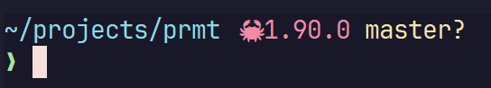

# prmt 🚀

> Ultra-fast, customizable shell prompt that won't slow you down

[](https://crates.io/crates/prmt)
[](https://opensource.org/licenses/MIT)
[](https://www.rust-lang.org)



> Rendered with `"{path:#89dceb}{rust:#f38ba8:f: 🦀}{git:#f9e2af:f: }\n{ok:#a6e3a1}{fail:#f38ba8} "`

## Features

- **⚡ Blazing Fast**: Sub-millisecond rendering for typical prompts (~2ms end-to-end)
- **🎨 Highly Customizable**: Full control over colors, formats, and what information to show
- **🚀 Context Aware**: Automatically detects git repos, project files, shows only what's relevant
- **📦 Zero Dependencies**: Single binary, no runtime dependencies required
- **🦀 Memory Efficient**: Zero-copy parsing with SIMD optimizations
- **✨ Smart Rendering**: Only shows information when relevant to your current directory

## Why prmt?

**Faster than alternatives** – Typical prompts render in ~2ms. Starship averages 10-50ms, oh-my-posh 20-100ms.

**Zero configuration needed** – Works out of the box with sensible defaults. Customize only what you want.

**Predictable performance** – No async operations, no network calls, no surprises. Your prompt is always instant.

**Single binary** – Just install and go. No configuration files required unless you want them.

**Context-aware** – Automatically detects git repositories, Rust/Node/Python projects, and shows only relevant info.

## Quick Start

**1. Install**
```bash
cargo install prmt
```

**2. Add to your shell** (pick one)

**Bash** – Add to `~/.bashrc`:
```bash
# Simple with named colors
PS1='$(prmt --code $? "{path:cyan} {git:purple} {ok:green}{fail:red} ")'

# Or with hex colors for precise theming
PS1='$(prmt --code $? "{path:#89dceb} {git:#f9e2af} {ok:#a6e3a1}{fail:#f38ba8} ")'
```

**Zsh** – Add to `~/.zshrc`:
```bash
setopt PROMPT_SUBST

# Simple with named colors
PROMPT='$(prmt --code $? "{path:cyan} {git:purple} {ok:green}{fail:red} ")'

# Or with hex colors for precise theming
PROMPT='$(prmt --code $? "{path:#89dceb} {git:#f9e2af} {ok:#a6e3a1}{fail:#f38ba8} ")'
```

**Fish** – Add to `~/.config/fish/config.fish`:
```fish
function fish_prompt
    prmt --code $status '{path:cyan} {git:purple} {ok:green}{fail:red} '
end
```

**3. Reload your shell**
```bash
exec $SHELL  # or open a new terminal
```

Done! 🎉

<details>
<summary>Advanced setup (PROMPT_COMMAND, precmd, environment variables)</summary>

### Bash with PROMPT_COMMAND
```bash
function _prmt_prompt() {
    local last=$?
    PS1="$(prmt --code $last '{path:cyan} {git:purple} {ok:green}{fail:red}')"
}
PROMPT_COMMAND=_prmt_prompt
```

*If you already use `PROMPT_COMMAND`, append `_prmt_prompt` instead of overwriting it.*

### Zsh with precmd
```zsh
function _prmt_precmd() {
    local code=$?
    PROMPT="$(prmt --code $code '{path:cyan} {git:purple} {ok:green}{fail:red}')"
}
typeset -ga precmd_functions
precmd_functions+=(_prmt_precmd)
```

### PowerShell
```powershell
# Add to $PROFILE
function prompt {
    prmt --code $LASTEXITCODE '{path:cyan:s} {git:purple:s:on :} {ok:green}{fail:red} '
}
```

### Environment Variable
All shells support using `PRMT_FORMAT` environment variable:

```bash
# Bash/Zsh
export PRMT_FORMAT="{path:cyan:r} {rust:red:m:v 🦀} {git:purple}"
PS1='$(prmt --code $?)\$ '

# Fish
set -x PRMT_FORMAT "{path:cyan:r} {python:yellow:m: 🐍} {git:purple}"

# PowerShell
$env:PRMT_FORMAT = "{path:cyan:r} {git:purple}"
```

</details>

## Popular Prompts

**Minimal**
```bash
prmt '{path:cyan:s} {ok:green}{fail:red} '
# Output: projects ❯
```

**Developer**
```bash
prmt '{path:cyan} {git:purple} {rust:red:s: 🦀} {node:green:s: ⬢} {ok:green}{fail:red} '
# Output: ~/projects/prmt on main 🦀1.90 ⬢20.5 ❯
```

**Compact with time**
```bash
prmt '{time:dim:12h} {path:cyan:s} {git:purple:s} {ok:green}{fail:red} '
# Output: 02:30PM projects main ❯
```

**Full featured with newline**
```bash
prmt '{path:cyan} {git:purple} {python:yellow:m: 🐍} {time:dim}\n{ok:green}{fail:red} '
# Output: ~/ml-project on develop 🐍3.11 14:30
#         ❯
```

**Status-focused**
```bash
prmt '{path:cyan:s} {git:purple:s:on :} {ok:green:✓}{fail:red:✗} '
# Output (success): projects on main ✓
# Output (failure): projects on main ✗
```

**With exit codes**
```bash
prmt '{path:cyan} {git:purple} {ok:green:❯}{fail:red::code} '
# Output (success): ~/projects main ❯
# Output (failure): ~/projects main 127
```

## Installation

```bash
# Install from crates.io
cargo install prmt

# Build from source (Rust 2024 edition required)
cargo build --release
cp target/release/prmt ~/.local/bin/

# Or install directly from source
cargo install --path .

# Verify installation
prmt --version
```

## Usage Examples

```bash
# Simple format with defaults
prmt '{path} {rust} {git}'
# Output: ~/projects 1.89.0 master

# Format with types and styles
prmt '{path::a}'                  # /home/user/projects (absolute path)
prmt '{path::r}'                  # ~/projects (relative with ~)
prmt '{path::s}'                  # projects (short - last dir only)
prmt '{path::strip}'              # ~/prjct (vowels stripped after first char)
prmt '{rust:red:s}'               # 1.89 in red (short version)
prmt '{rust:red:m:v:}'            # v1 in red (major version with prefix)
prmt '{path:cyan:s:[:]}'          # [projects] in cyan
prmt '{git:purple::on :}'         # on master in purple

# Simplified formats with omitted parts
prmt '{rust::::!}'                # 1.89.0! (default style/type, suffix only)
prmt '{rust:::v:}'                # v1.89.0 (default style/type, prefix only)
prmt '{path::::]}'                # ~/projects] (suffix only)
prmt '{git:::on :}'               # on master (prefix only)

# Add your own icons with prefix
prmt '{rust::: 🦀}'               # 🦀1.89.0 (default color)
prmt '{node:green:: ⬢}'           # ⬢20.5.0 in green
prmt '{python:yellow:: 🐍}'       # 🐍3.11.0 in yellow

# Or add spacing with suffix for better readability
prmt '{rust::: 🦀 }'              # 🦀 1.89.0 (space after icon)
prmt '{node:green:: ⬢ }'          # ⬢ 20.5.0 (space after icon)

# Using short format aliases
prmt '{path:cyan:s} {rust:red:m:v:}' # projects v1 (both in color)
prmt '{git::s:on :}'              # on master (short format with prefix)

# No style with type
prmt '{path::s}'                  # projects (no color, short)
prmt '{path::a}'                  # /home/user/projects (no color, absolute)
prmt '{rust::m:v}'                # v1 (no color, major with prefix)

# With exit code indicators (requires --code flag)
prmt --code $? '{path:cyan} {ok:green}{fail:red}'
# Output (success): ~/projects ❯ (green)
# Output (failure): ~/projects ❯ (red)

# Fast mode (no version detection)
prmt --no-version '{path:cyan} {rust:red} {node:green}'
# Output: ~/projects (only shows active modules, no versions)

# Custom symbols for ok/fail using type as symbol
prmt --code $? '{path} {ok::✓} {fail::✗}'
# Output (success): ~/projects ✓
# Output (failure): ~/projects ✗

# Show exit code on failure
prmt --code $? '{path} {ok::❯} {fail::code}'
# Output (success): ~/projects ❯
# Output (failure with code 127): ~/projects 127

# Time formats
prmt '{time}'                     # 14:30 (default 24h)
prmt '{time::24hs}'               # 14:30:45
prmt '{time::12h}'                # 02:30PM
prmt '{time::12hs}'               # 02:30:45PM
prmt '{path:cyan} {time:dim:12h}' # ~/projects 02:30PM (with styling)
```

## Format Specification

### Format Syntax
```
{module}                      - Default everything
{module:style}                - Custom style
{module:style:type}           - Custom style and type
{module:style:type:prefix}    - Add prefix to value
{module:style:type:prefix:postfix} - Add prefix and postfix

# Omitting parts (empty means default)
{module::::suffix}            - Default style/type, suffix only
{module:::prefix:}            - Default style/type, prefix only
{module:::prefix:suffix}      - Default style/type, both prefix/suffix
{module::type}                - No style, specific type
{module::type::suffix}        - No style, specific type, suffix only
```

### Available Modules

| Module | Detection | Description |
|--------|-----------|-------------|
| `path` | Always active | Current directory with ~ for home |
| `ok` | Exit code = 0 | Shows when last command succeeded (default: ❯) |
| `fail` | Exit code ≠ 0 | Shows when last command failed (default: ❯) |
| `git` | `.git` directory | Branch name with status indicators |
| `node` | `package.json` | Node.js version |
| `python` | `requirements.txt`, `pyproject.toml`, etc | Python version |
| `rust` | `Cargo.toml` | Rust version |
| `deno` | `deno.json`, `deno.jsonc` | Deno version |
| `bun` | `bun.lockb` | Bun version |
| `go` | `go.mod` | Go version |
| `time` | Always active | Current time in various formats |

### Type Values

**Version modules** (rust, node, python, etc.):
- `full` or `f` - Full version (1.89.0)
- `short` or `s` - Major.minor (1.89)
- `major` or `m` - Major only (1)

**Path module**:
- `relative` or `r` - Path with ~ for home directory (default)
- `absolute`, `a`, or `f` - Full absolute path without ~ substitution
- `short` or `s` - Last directory only

**Git module**:
- `full` or `f` - Branch with status (default)
- `short` or `s` - Branch name only

**Ok/Fail modules**:
- `full` - Default symbol (❯)
- `code` - Shows the actual exit code number
- *Any other string* - Uses that string as the symbol (e.g., `{ok::✓}` shows ✓)

**Time module**:
- `24h` - 24-hour format HH:MM (default)
- `24hs` or `24HS` - 24-hour format with seconds HH:MM:SS
- `12h` or `12H` - 12-hour format hh:MMAM/PM
- `12hs` or `12HS` - 12-hour format with seconds hh:MM:SSAM/PM

### Type Validation

The format parser validates types at parse time to catch errors early:

```bash
# Valid types for each module
prmt '{path::short}'     # ✓ Valid
prmt '{rust::major}'     # ✓ Valid
prmt '{ok::✓}'          # ✓ Valid (custom symbol)
prmt '{fail::code}'     # ✓ Valid (shows exit code)

# Invalid types produce clear errors
prmt '{path::major}'
# Error: Invalid type 'major' for module 'path'. Valid types: relative, r, absolute, a, short, s

prmt '{git::major}'
# Error: Invalid type 'major' for module 'git'. Valid types: full, short
```

### Default Module Styles

| Module | Default Color | Can Override |
|--------|--------------|--------------|
| `path` | cyan | Yes |
| `ok` | green | Yes |
| `fail` | red | Yes |
| `git` | purple | Yes |
| `node` | green | Yes |
| `rust` | red | Yes |
| `python` | yellow | Yes |
| `go` | cyan | Yes |
| `deno` | - | Yes |
| `bun` | - | Yes |
| `time` | - | Yes |

### Styles

**Colors**: `black`, `red`, `green`, `yellow`, `blue`, `purple`, `cyan`, `white`, `#hexcode`

**Modifiers**: `bold`, `dim`, `italic`, `underline`, `reverse`, `strikethrough`

Combine with dots: `cyan.bold`, `red.dim.italic`

### Escaping

- `\{` → `{` (literal brace)
- `\}` → `}` (literal brace)
- `\n` → newline
- `\t` → tab
- `\:` → `:` (literal colon in fields)
- `\\` → `\` (literal backslash)

## Performance

### Actual Response Times
| Scenario | Time | Notes |
|----------|------|-------|
| Path only | ~0.01ms | Minimal prompt |
| Path + Git | ~1-2ms | Branch and status |
| With Rust version | ~25-30ms | Includes `rustc --version` |
| With `--no-version` | <5ms | Skips all version detection |

### Benchmark Snapshot

| Scenario | Time (µs) | Notes |
|----------|-----------|-------|
| Minimal render | 0.69 | `{path}` only |
| Typical prompt | 1.71 | `{path} {git} {ok}{fail}` |
| Full prompt with versions | 4.90 | `{path} {git} {rust} {node}` |
| End-to-end (typical) | 2.53 | `prmt` binary execution |

> Measurements captured on an Intel Core i9-13900K host with project files on a SATA SSD (Rust 1.90.0 release build). Each value is the median of 100 `cargo bench` runs.

**Why is it fast?**
- Zero-copy parsing with SIMD optimizations
- Efficient memory allocation strategies
- Context-aware detection (only checks what's needed)
- No async operations or network calls
- Written in Rust for maximum performance

## Command-Line Options

```
prmt [OPTIONS] [FORMAT]

OPTIONS:
    -n, --no-version    Skip version detection for speed
    -d, --debug         Show debug information and timing
    -b, --bench         Run benchmark (100 iterations)
        --code <CODE>   Exit code of the last command (for ok/fail modules)
        --no-color      Disable colored output
    -h, --help         Print help
    -V, --version      Print version

ARGS:
    <FORMAT>           Format string (default from PRMT_FORMAT env var)
```

## Building from Source

```bash
# Requirements: Rust 2024 edition
git clone https://github.com/3axap4eHko/prmt.git
cd prmt
cargo build --release

# Run tests
cargo test

# Benchmark
./target/release/prmt --bench '{path} {rust} {git}'
```

## License

License [The MIT License](./LICENSE)
Copyright (c) 2025 Ivan Zakharchanka
